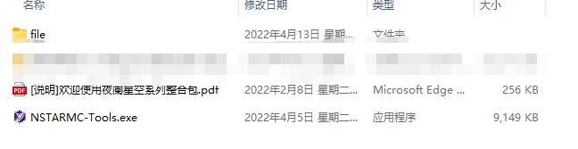
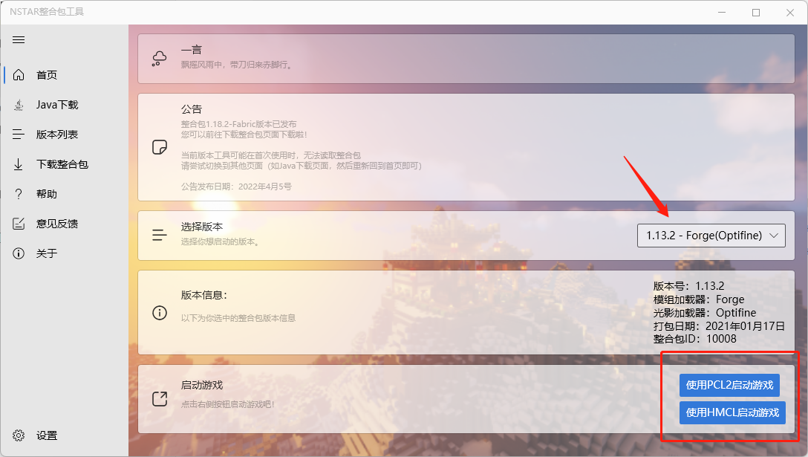
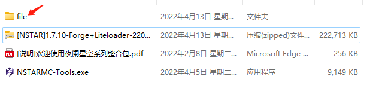
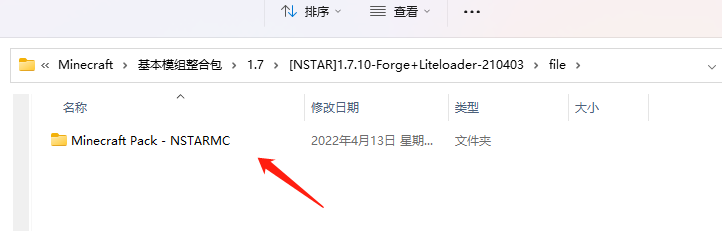
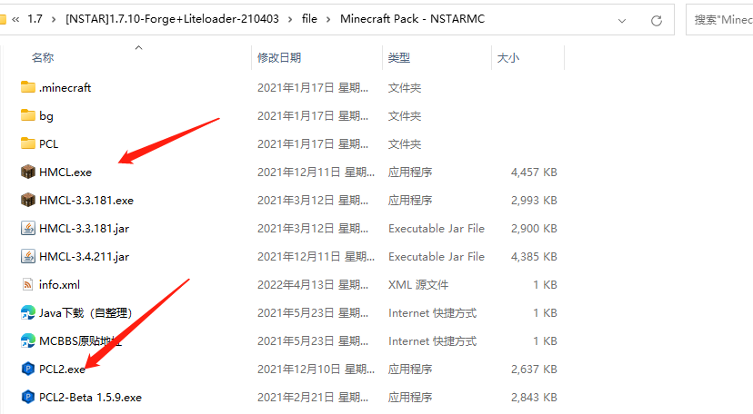

# 启动整合包

## ①解压缩整合包

解压后，你将得到以下3个文件

双击启动NSTARMC-Tools

::: tip 提示
如果你只下载了NSTARMC-Tools，你需要参考“整合包管理—下载整合包”文档

先进行整合包下载，然后再启动游戏

:::

## ②选择你喜欢的启动器，启动游戏

::: info 记得下载Java环境
现在的整合包均不再自带Java环境，

如果你没有安装Java，你可以在Java下载页面安装Java，再启动游戏

（如果不会安装，请参考文档“整合包管理-下载整合包Java环境”）

:::

选择你想玩的整合包版本，点击你想要的启动器

启动启动器即可！

## ③绕过NSTARMC-Tools启动整合包

::: danger 不建议这样做
NSTARMC-Tools可以为您安装Java环境
提供整合包公示信息/bug
整合包更新功能
因此，我们不建议通过此方法启动整合包
:::

进入file文件夹

再进入整合包文件夹

找到启动器，启动即可！

