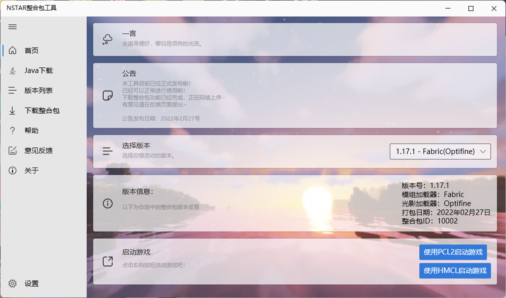

# 下载NSTARMC-Tools

## 下载NSTARMC-Tools

**下载最新版本：[下载](https://res.nstarmc.cn/latest/NSTARMC-Tools.exe)**

::: tip 运行环境

本工具运行需要以下两个运行环境

软件本体运行环境 — .NET Framework 4.8 [Windows10+ 自带]  [点击下载](https://go.microsoft.com/fwlink/?linkid=2088631)  

软件浏览器扩展运行环境 — Webview2 [Windows11+ 自带]  [点击下载](https://msedge.sf.dl.delivery.mp.microsoft.com/filestreamingservice/files/61941fe4-55e6-4948-ac81-919de7e15d5b/MicrosoftEdgeWebView2RuntimeInstallerX64.exe)

:::

**下载历史版本：**

请前往Github Releases下载

仓库：[Releases · nstarmc/NSTARMC-Tools (github.com)](https://github.com/nstarmc/NSTARMC-Tools/releases)

注意：不建议下载历史版本，历史版本都会自动更新到最新版本！

## 关于NSTARMC-Tools

NSTARMC-Tools是一款专门为NSTAR系列整合包所定制的一款工具，具有接收整合包信息，下载整合包，下载安装Java运行环境，更新整合包等功能

